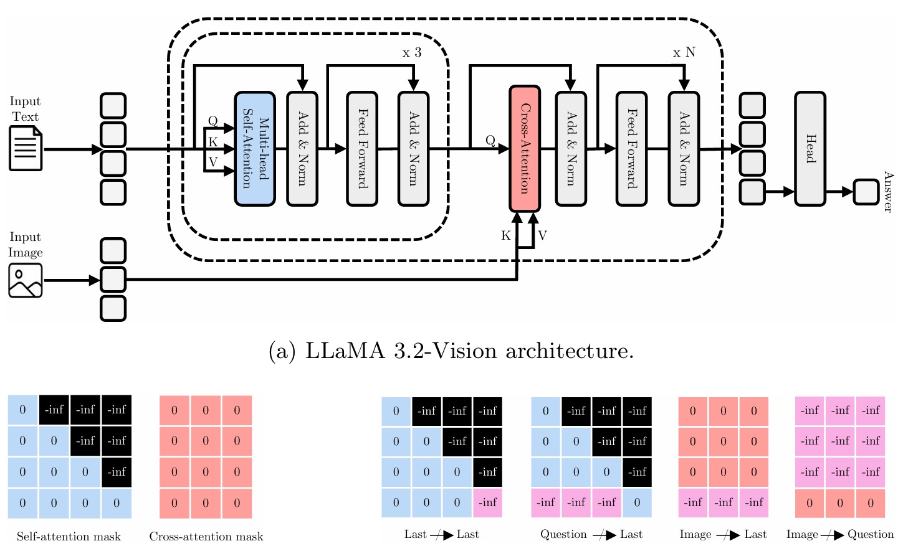

# Tracing Information Flow in LLaMA Vision: A Step Toward Multimodal Understanding
[[Paper]]() [[Bib]]()

<figure>
 
 <figcaption><em>Overview of the proposed method. (a) LLaMA 3.2-Vision architecture; (b) default attention masking mechanism used in self- and cross-attention layers; (c) modified attention masks enabling analysis of distinct information flows, including last-to-last, question-to-last, image-to-question, and image-to-last pathways.</em></figcaption>
</figure>

This repository contains the code used in our paper "Tracing Information Flow in LLaMA Vision: A Step Toward Multimodal Understanding". 

## 📘 Overview
We present the first systematic analysis of the information flow between language and vision modalities in LLaMA 3.2-Vision, aiming to advance the understanding of the internal dynamics of of multimodal large language models (MLLMs). 

This repository provides everything needed to reproduce our experiments and results on visual question answering (VQA) tasks using the following datasets:
- [VQAv2](https://visualqa.org/) (for open-ended VQA)
- [Visual7W](https://ai.stanford.edu/~yukez/visual7w/) (for multiple-choice VQA)
- [DocVQA](https://www.docvqa.org/) (for document VQA)

## 📂 Contents
- `eval/` – Evaluation scripts
- `model/` - Model architecture definitions
- `tracing_information_flow/` - Scripts to create the datasets used for our analysis

## 🚀 Getting Started
### Download LLaMA 3.2-Vision
Before running this project, you need to download the folder with the config and checkpoint files of LLaMA-3.2-Vision from HuggingFace, specifically the [11B version](https://huggingface.co/meta-llama/Llama-3.2-11B-Vision). Then set in the `config.json` file this configuration:
```
"_attn_implementation": "eager"
```

### Install the environment
Clone this repository, create a conda env for the project and activate it. Then install all the dependencies with pip.
```
conda create -n llama_tracing python=3.10.17
conda activate llama_tracing
pip install -r requirements.txt
```

### Tracing Information Flow
To analyze the information flow in LLaMA 3.2-Vision across the VQAv2, Visual7W, and DocVQA datasets, run the corresponding scripts `vqa_v2_with_attention_blocking.py`, `visual7w_with_attention_blocking`, and `docvqa_with_attention_blocking` with the following arguments:

```
  --model_path <MODEL_PATH> \                  # Directory for the checkpoint of the model
  --image_dir <IMAGE_DIR> \                    # Directory containing the images
  --block_types <BLOCK_TYPE> \                 # Pathway you want to block
  --k <K_VALUE>                                # Window size K
```

where `<BLOCK_TYPE>` can be chosen from:
```
"last_to_last"
"question_to_last"
"image_to_last"
"image_to_question"
```

## 🔄 If you want to re-create the datasets used for the analysis
#### Step1: Evaluate the Model 
Run the corresponding scripts for each dataset using the following arguments. 

VQAv2:
```
python vqa_v2.py \
  --model_path <MODEL_PATH> \                  # Directory for the checkpoint of the model
  --image_dir <IMAGE_DIR> \                    # Directory containing the images
  --annotation_path <ANNOTATION_PATH> \        # Path to the annotation json file
  --question_path <QUESTION_PATH> \            # Path to the question json file
```

Visual7W:
```
python visual7w.py \
  --model_path <MODEL_PATH> \                  # Directory for the checkpoint of the model
  --image_dir <IMAGE_DIR> \                    # Directory containing the images
  --annotation_path <ANNOTATION_PATH> \        # Path to the annotation json file
```

DocVQA:
```
python docvqa.py \
  --model_path <MODEL_PATH> \                  # Directory for the checkpoint of the model
  --image_dir <IMAGE_DIR> \                    # Directory containing the images
  --annotation_path <ANNOTATION_PATH> \        # Path to the annotation json file
```

#### Step2: Check Correcly Predicted Samples
To create datasets with the model's correctly predicted answers, run the evaluation scripts below:
- `eval/eval_vqa.py`
- `eval/eval_visual7w.py` 
- `eval/eval_docvqa.py` 
Each script taskes:
```
  --results <RESULT_PATH>                      # Path to your result file
```
#### Step3: Build Final Datasets
To generate the final datasets used for information flow analysis, run:
- `tracing_information_flow/create_vqa.py`
- `tracing_information_flow/create_visual7w.py` 
- `tracing_information_flow/create_docvqa.py` 
Before running these scripts, make sure to set the correct paths at the top of each file. The final datasets will be created inside the corresponding subfolders in:
```
tracing_information_flow/dataset/
```

## References
* [LLaMA 3.2 Vision](https://arxiv.org/abs/2407.21783)

